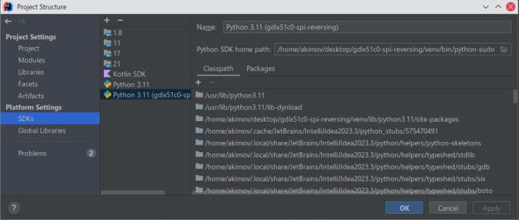

# Реверс-инжиниринг протокола сканера отпечатка пальцев Goodix 51C0 (SPI)

<p align="center">

</p>

| Скрипт                                             | Описание                                                                                     |
|----------------------------------------------------|----------------------------------------------------------------------------------------------|
| [protocol_interaction.py](protocol_interaction.py) | prove-of-concept работы со сканером. Запускать из под root.                                  |
| [image_decode.py](image_decode.py)                 | пример декодирования изображения из пакета данных, полученных в предыдущем скрипте           |
| [tls_test.py](tls_test.py)                         | пример TLS-рукопожатия между драйвером и сканером, а также получение и расшифровка сообщений |

## Настройка драйвера spidev

Сначала проверьте что устройство действительно отображается в sysfs:
```shell
ls /sys/bus/spi/devices/
# > spi0.0  spi-GDIX51C0:00
```
Если устройство `spi-GDIX51C0:00` присутствует, выполните шаг за шагом:
```shell
sudo su
modprobe spidev

# проверить, что spidev загружен:
lsmod | grep spidev
# > spidev                 28672  0

# подсоединить устройство spi-GDIX51C0:00 к драйверу spidev
# (взято отсюда https://docs.kernel.org/spi/spidev.html)
echo spidev > /sys/bus/spi/devices/spi-GDIX51C0:00/driver_override
echo spi-GDIX51C0:00 > /sys/bus/spi/drivers/spidev/bind

# проверить, что устройство spidev появилось в /dev:
ls /dev/spidev*
# > /dev/spidev1.0
```

## Настройка виртуального окружения
_Необходимо наличие Python 3 с установленным `virtualenv`._

- в корневой папке проекта создайте виртуальное окружение:
```shell
virtualenv venv
```

- активируйте его:
```shell
source ./venv/bin/activate
```

- установите зависимости:
```shell
pip install -r requirements.txt
```

## Запуск скрипта
Т.к. для доступа к SPI и GPIO-устройствам нужны права суперпользователя, его нужно запускать из под root:
```shell
sudo python protocol_interaction.py
```

## Отладка в IDE
Для отладки можно запускать скрипт в среде разработки (например PyCharm или Intellij IDEA с установленным плагином 
[Python](https://www.jetbrains.com/help/idea/plugin-overview.html)), предварительно отключив запрос пароля для root-пользователя. Для этого:

- создайте в виртуальном окружении скрипт для запуска интерпретатора python из под root-пользователя:
```shell
cat << EOF > ./venv/bin/python-sudo
#!/bin/bash
sudo $(pwd)/venv/bin/python "\$@"
EOF
chmod +x ./venv/bin/python-sudo
```

- создайте файл `/etc/sudoers.d/venv-python` со следующим содержанием:
```
user_name machine_name = (root) NOPASSWD: /path/to/project/venv/bin/python
```
Например, так:
```
akimov huawei-rlefxx = (root) NOPASSWD: /home/akimov/desktop/gdix51c0-spi-reversing/venv/bin/python
```

- проверка, что все было выполнено корректно:
```
(venv) [akimov@huawei-rlefxx gdix51c0-spi-reversing]$ python-sudo 
Python 3.11.6 (main, Nov 14 2023, 09:36:21) [GCC 13.2.1 20230801] on linux
Type "help", "copyright", "credits" or "license" for more information.
>>> import getpass
>>> getpass.getuser()
'root'
>>> exit()
```

Теперь в виртуальном окружении можно запускать python из под root пользователя без запроса пароля.

вместо `python` используйте команду `python-sudo`.

### Настройка интерпретатора с root-правами в IDE
- в Intellij IDEA зайдите в `File -> Project Structure -> SDKs -> Add new SDK -> Add Python SDK`
- на вкладке `Virtual environment -> Existing environment -> Interpreter ...` и выберите файл `[project path]/venv/bin/python-sudo`
Все будет выглядеть примерно так:

<p align="center">

</p>

- нажмите `Apply`
- перейдите на вкладку `Project`
- выберите в выпадающем списке SDK созданный интерпретатор
- нажмите OK

### Отладка
Запуск отладки через клик ПКМ на [protocol_interaction.py](protocol_interaction.py) -> `Debug 'protocol_interaction.py'`.